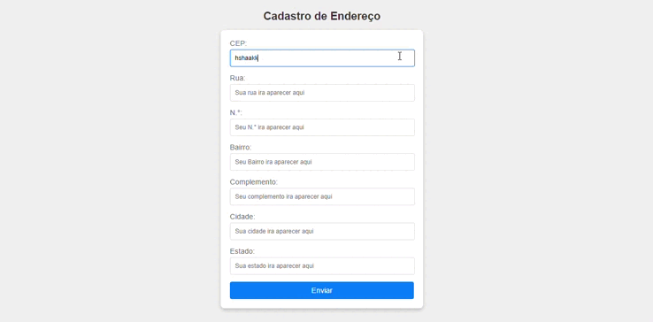

# 📍 Cadastro de Endereço

Este projeto permite o preenchimento automático de campos de endereço com base no CEP informado pelo usuário. Utiliza a API ViaCEP para buscar as informações necessárias.

# Sumario

# 💎 Principais Funções

limparFormulario(): Limpa todos os campos do formulário.

eNumero(numero): Verifica se a entrada contém apenas números.

cepValido(cep): Valida se o CEP possui 8 dígitos.

preencherFormulario(endereco): Preenche os campos com os dados do endereço retornados pela API.

pesquisarCep(): Realiza a pesquisa do CEP e preenche o formulário caso a busca seja bem-sucedida.

# 🚀 Funcionalidades

Validação de CEP: Verifica se o CEP digitado possui 8 dígitos e é composto apenas por números.

Preenchimento Automático: Preenche os campos de endereço com os dados retornados pela API.

Limpeza de Campos: Limpa os campos de endereço antes de realizar uma nova busca.

# 🟡 Resumo-da-funcionalidade

O projeto basea-se em tornar mais pratico a realização de cadstro de endeço. Qual quando é digitado o cep preenche todo os outro campos como; bairro, cidade... mantando a padronização.

# Explanção-do-codigo

1.  Inicio:
    > - 'use strict'; ativa um modo de programação que evita erros comuns, garantindo que o código seja mais seguro.

2. Função limparFormulario:

    > Limpa os campos do formulário de endereço ao definir seus valores como vazios, utilizando getElementById.

3. Validação do CEP:

    > - Função eNumero: Verifica se o valor contém apenas dígitos numéricos usando uma expressão regular.
    >
    > - Função cepValido: Confirma se o CEP possui exatamente 8 dígitos e é numérico.

4. Função preencherFormulario:

    > Recebe um objeto endereco e preenche os campos do formulário com os dados correspondentes, como logradouro e bairro.

5. Função pesquisarCep:

    >- Assíncrona: Utiliza async/await para lidar com a API.
    >
    > - Limpa o formulário e monta a URL da requisição.
    >
    > - Verifica se o CEP é válido, faz uma requisição à API viaCep, e trata a resposta convertendo-a para JSON.
    > - Se o CEP não for encontrado, exibe um alerta; caso contrário, preenche o formulário.

6. Escutador de Evento:

    > - addEventListener é usado para chamar a função pesquisarCep quando o usuário sai do campo CEP (evento focusout).

# ⚙️ Como Usar

Digite o CEP no campo correspondente.
O formulário será automaticamente preenchido com as informações do endereço.

Caso o CEP não seja encontrado ou seja inválido, uma mensagem de alerta será exibida.

# 🧮 Tecnologias Utilizadas

- HTML

- CSS

- JavaScript

- API ViaCEP

# 📝 Fontes

- viaCep

# 👧🏻 Participantes

- Sarah

# orientação

- Professou leonardo (da escola marista irmão acácio)

